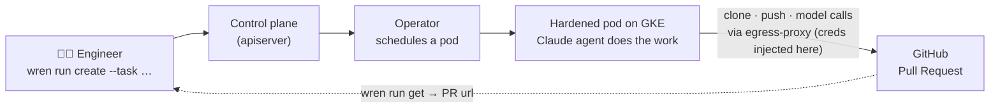

# Wren

**Wren is the backbone of an internal Software Factory** — a developer-experience
CLI plus the GCP/Kubernetes control plane behind it, so an engineer can spin up
**massively parallel, durable, sandboxed coding agents in the cloud** with one
command.

Submit a task; a coding agent (Claude Code today, Codex / bring-your-own next)
clones the repo and does the work in a hardened cloud pod, survives crashes, and
**opens a pull request** — all without the agent ever holding a credential.

> 📄 **Design & internals:** [`docs/technical-spec.md`](docs/technical-spec.md) ·
> 🛠 **Install / handover:** [`SETUP.md`](SETUP.md) ·
> 🤝 **Contributing:** [`AGENTS.md`](AGENTS.md)

---

## What works today

The core of milestone **M0 — submit a task, get a pull request** — is complete and
**validated end-to-end on both a local `kind` cluster and real GKE**:

```
$ wren run create --project payments-api \
    --task "Add input validation to the signup endpoint"
{ "id": "r-9d4c09a", "project": "payments-api", "phase": "Pending", "harness": "claude-code" }

$ wren run get r-9d4c09a
{ "id": "r-9d4c09a", "phase": "Succeeded",
  "prUrl": "https://github.com/acme/payments-api/pull/128" }
```

A real run: the engineer submits a task → the control plane creates an `AgentRun`
→ the operator schedules a hardened pod → **the real Claude agent explores the
repo and edits files** → the change is committed, pushed, and **a real PR is
opened**. The GitHub token and model API key live only on a trusted egress-proxy
sidecar; **the untrusted agent container holds no secrets**. Crashes (OOM,
eviction) auto-resume; deterministic failures fail fast.

## How a run flows



The **credential boundary** is the heart of the security model: the agent
(untrusted, running model-generated code) routes all network access through the
in-pod **egress-proxy**, which enforces a domain allowlist and injects the
GitHub/Anthropic credentials on the way out. See the full sequence diagram and
threat model in the [spec](docs/technical-spec.md#25-end-to-end-workflow-journey-a).

## Using Wren (engineer)

```sh
wren login --control-plane wren.corp.internal --user you   # SSO lands in M1
wren run create --project payments-api --task "Fix the flaky retry in checkout"
wren run get    r-9d4c09a          # phase, PR url, token usage, restart count
wren run list   --scope mine
```

Each run is attributable, resumable, and produces a reviewable PR — not a mystery
diff. (`run logs`, `attach`/`steer`, `fleet`, and `usage` are milestone-tagged
in the CLI and land in M1–M2.)

## Installing Wren (admin / handover)

Full runbook in [`SETUP.md`](SETUP.md). Phase-1 (existing cluster, PAT-first) is a
single command:

```sh
KIND_CLUSTER=wren-test WREN_NS=user-me \
GITHUB_TOKEN=$(gh auth token) ANTHROPIC_API_KEY=sk-ant-... \
  hack/setup.sh          # cluster access → images → CRDs/RBAC → secrets
```

It configures cluster access, builds/publishes the images, installs the CRDs +
RBAC, and creates the credential secrets (mounted into the egress-proxy, never
the runner). GKE is the same with `GKE_PROJECT`/`GKE_CLUSTER`/`REGISTRY`.

## Architecture at a glance

```
 wren CLI ──HTTP──▶ control plane ──creates──▶ AgentRun CR ──watch──▶ operator
                    (Runs/Projects)                                      │
                                                                    schedules
                                                                        ▼
   ┌──────────────────────── hardened agent pod (per run) ─────────────────┐
   │  egress-proxy (creds + allowlist) ◀── harness runner (Claude, no creds)│
   │  + checkpointer + gateway sidecars   + hydrate init  + workspace PVC   │
   └───────────────────────────────────────────────────────────────────────┘
```

- **CLI** talks only to the control plane (never to Kubernetes).
- **Control plane** resolves project config and translates a task into an
  `AgentRun` custom resource.
- **Operator** (controller-runtime) reconciles each `AgentRun` into a hardened
  pod, owns the lifecycle, and auto-resumes on infrastructure crashes.
- **Agent pod** is the sandbox: one untrusted harness container + trusted
  sidecars (egress-proxy holds the credentials); the runner reaches the internet
  only through the proxy.

Full architecture, domain model, lifecycle state machine, security/threat model,
and module map: [`docs/technical-spec.md`](docs/technical-spec.md).

## Status (built vs. designed)

The spec (§1–§9) describes the **target** design; M0 is the first working slice.

| Area | M0 (as built) | Target |
|---|---|---|
| Task → PR (Journey A) | ✅ real Claude agent → PR, on kind **and** GKE | same |
| Crash-resume | ✅ retries infra failures, fails fast on deterministic ones | same |
| Egress-proxy | ✅ injects creds + allowlist; runner holds no secret | + **bypass enforcement** (NetworkPolicy/iptables) |
| Control plane | ✅ runs locally against the cluster | in-cluster Deployments |
| GitHub creds | ✅ PAT in the proxy secret | per-run **GitHub App** tokens |
| API transport | HTTP/JSON | gRPC + Connect |
| Store | in-memory | Cloud SQL / Postgres |
| Auth | `X-Wren-User` header | OIDC / SSO |
| Isolation | hardened `runc` pods | + gVisor/Kata (deferred, M4) |

Next up: (1) in-cluster control plane + GitHub App, then (2) egress bypass
enforcement.

## Repository layout

```
api/v1alpha1/         CRDs: AgentRun, AgentPool (+ generated deepcopy + YAML)
cmd/
  wren/               CLI entrypoint
  wren-apiserver/     control-plane HTTP API
  wren-operator/      Kubernetes operator (controller-runtime manager)
  wren-runtime/       multi-call in-pod binary (harness + sidecars)
internal/
  cli/ client/ config/     CLI command tree, HTTP client, local config
  apiserver/ coreapi/       control-plane HTTP handlers + Runs/Projects logic
  store/ launcher/          persistence (in-memory) + AgentRun CR creation
  controller/               AgentRun/AgentPool reconcilers + pod builder
  harness/ podruntime/      harness adapters (claude-code, mock) + in-pod roles
  egress/                   the credential-injecting allowlist proxy
  github/ gitwork/ finalize/  GitHub PR client, go-git ops, commit→push→PR
  runspec/                  the RunSpec contract handed to each harness
build/                Dockerfiles (runtime, claude-code)
config/               kustomize manifests (crd, rbac, manager) + samples
hack/                 setup.sh
docs/                 technical specification
```

## Build, test, run

Requires **Go 1.26+** and Docker. (A stale system Go may shadow it — see
[`AGENTS.md`](AGENTS.md) for the PATH note.)

```sh
make build            # -> ./bin/wren
make build-operator   # -> ./bin/wren-operator
make build-apiserver  # -> ./bin/wren-apiserver
make build-runtime    # -> ./bin/wren-runtime

make test             # unit tests (fake k8s client, httptest, local git repos)
make cover            # per-package coverage
make vet fmt tidy
make manifests generate   # regenerate CRD/RBAC YAML + DeepCopy from code
```

For a full local end-to-end (kind + operator + apiserver + a real task), see the
recipe in [`AGENTS.md`](AGENTS.md#7-local-end-to-end-on-kind) and
[`SETUP.md`](SETUP.md).
