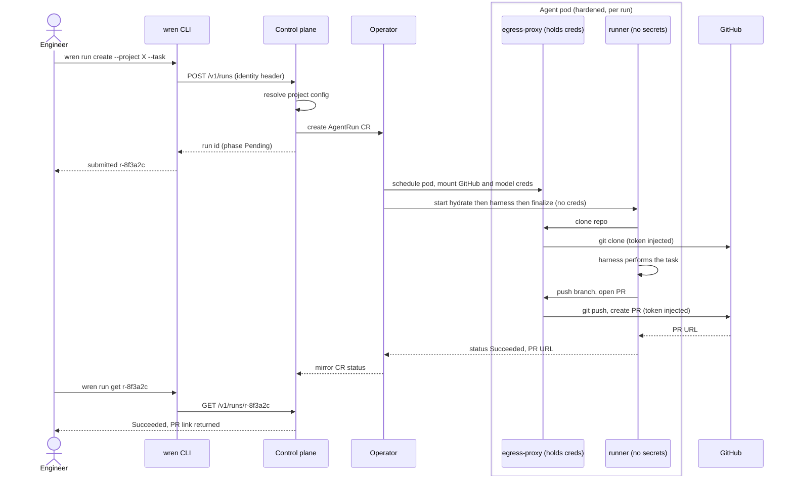

# Wren — Technical Specification

> **Status:** Draft v0.4 (living) · **Owner:** Platform / Software Factory · **Last updated:** 2026-07-13
>
> `Wren` is a working name for the platform and its CLI binary (`wren`). Names are placeholders and can change without affecting the design.

### Implementation status (living — updated as we build)

The **core of milestone M0 — Journey A (task → PR)** — is built and validated end-to-end (unit tests + real-cluster e2e on **kind and real GKE**). A few M0 hardening items remain (see "Next milestones"). Built and validated:

- **CLI** (`cmd/wren`) — command tree; `login`, `run create/list/get/logs` wired to the control-plane HTTP API (`run logs [-f] [--container]` streams pod logs — resolves the run's current pod by the `wren.dev/run` label and tails the `pods/log` subresource).
- **Operator** (`cmd/wren-operator`, `internal/controller`) — `AgentRun` reconciler (hardened pod + workspace PVC + RunSpec ConfigMap, lifecycle, crash-resume via PVC reattach + resume-mode — see the §5.5 v0.1 status), `AgentPool` skeleton. CRDs + RBAC + manager manifests under `config/`.
- **Control plane** (`cmd/wren-apiserver`, `internal/{apiserver,coreapi,store,launcher}`) — Runs + Projects services; creates `AgentRun` CRs and mirrors CR status back.
- **Harness runtime** (`cmd/wren-runtime`, `internal/{harness,podruntime}`) — the multi-call in-pod binary implementing the §5.4 contract's batch subset (RunSpec in, event stream + exit-code contract out; interactive input lands in M2, transcript-restore resume is post-launch with the checkpointer). Adapters: **claude-code** (real — drives the bundled `claude` CLI headless in the cloned workspace and parses its stream-json events into Wren events + token usage), **codex** + **opencode** (WS-12: adapters, images, and credential wiring built and unit-tested — **not yet run against the live providers**; see docs/harnesses.md), and **mock** (deterministic, keyless). Images: `build/Dockerfile.{runtime,claude-code,codex,opencode}`.
- **Egress-proxy** (`internal/egress`) — the pod's controlled egress: enforces a domain allowlist and **injects the GitHub token + model key** for github.com / api.github.com / api.anthropic.com / api.openai.com (the `/openai/` route, WS-12, is wired but not yet exercised against a live key). The credentials live only on the proxy container; the runner holds no secret.
- **GitHub PR / finalize** (`internal/{github,gitwork,finalize}`) — go-git clone/commit/push (distroless-friendly, no git binary) + open a PR with the rubric body, plus a GitHub **App installation-token minter**. Hydrate clones and finalize pushes/opens the PR *through the egress-proxy*.
- **Verified e2e on kind AND real GKE (Journey A):** `wren run create` → CR (carrying `repo`) → operator schedules the hardened pod → egress-proxy (holds creds) → hydrate clones via proxy → **the real Claude Code agent does the task** (Bash/Write tools, autonomous) → finalize opens a **real PR** through the proxy → pod `Completed` → run **`Succeeded`** → `wren run get` reflects it. On GKE: image pulled from Artifact Registry, workspace on a Persistent Disk, runner container held **no token or model key** (both injected at the proxy).

**M0 implementation decisions (deviations from the target design, to revisit):**

- **Transport:** control-plane API is **HTTP/JSON** (net/http) for M0; the target gRPC + Connect (§5.1/§5.2) is a fast-follow.
- **Store:** two impls behind the `Store` interface — **in-memory** (`internal/store.Memory`, the default for dev/tests) and **Postgres** (`internal/store.Postgres`, pgx/v5, embedded forward-only migrations) selectable via `--store=postgres` + `DATABASE_URL`. On boot the apiserver reconciles run rows from the AgentRun CRs, so a restart re-learns in-flight runs. Managed Cloud SQL + Helm-provisioned DSN is the remaining target (§5.2, WS-5).
- **Auth:** caller identity via a trusted **`X-Wren-User` header** stand-in for M0; OIDC/SSO at a gateway is the target (§7).
- **Control-plane hosting:** the operator + apiserver run **in-cluster** (`config/default` overlay: Deployments + a ClusterIP Service for the apiserver; `make e2e` deploys and drives this path). Running them locally against the cluster remains the dev loop (AGENTS.md §7). Remaining for the handover: published images and an Ingress/OIDC front-door (§7) — that plus the GitHub App wiring is the next milestone.
- **GitHub credentials:** a **PAT** (mounted into the egress-proxy) for M0; the target is per-run, repo-scoped **GitHub App installation tokens** minted by the control plane (§5.7). The App-token minter is already built.
- **Egress enforcement:** **enforced** — an `egress-lockdown` privileged init container installs iptables OUTPUT rules (uid-match, Istio-style) so the runner is *physically* confined to the proxy (no direct egress, DNS included); a `--egress-enforcement=off` escape hatch exists for clusters that forbid privileged init containers (e.g. GKE Autopilot), which records an `EgressEnforcement=Disabled` condition on each run (§5.6).
- **Run results → status (v0.1):** the operator scrapes the harness container's logs for the terminal `pr_ready`/`token_usage` events when the pod goes terminal (and before deleting a failed pod for resume) and writes `Status.PR`/`Usage`/`SessionID` — the pod holds no SA token by design, so the runner cannot write its own status and this adds no credentials or attack surface. v0.1 records **terminal values only**: mid-run `token_usage` increments are superseded by the last one, and no adapter emits a session id yet. The gateway event bridge (§5.4) remains the v0.2 target; the event schema is unchanged, so the swap is internal to the pod. Finalize is resume-safe (an existing run branch is reused, never "branch already exists") and transient push/PR failures (network, 429/5xx, EOF/timeout) exit `ExitRetryable` so a fresh pod retries them.
- **Isolation:** agent pods run under `runc`; gVisor/Kata deferred to M4 (§5.6), as already noted.

**Next milestones (not yet built):**

1. **GitHub App + control-plane front-door** — the operator + apiserver already run **in-cluster** (`config/default`; exercised by `make e2e`). Remaining: published images, an apiserver Ingress/OIDC front-door, and minting per-run, repo-scoped **GitHub App** installation tokens in place of the PAT. This makes the platform self-hosting and the handover real.
2. ~~**Egress bypass enforcement**~~ — **done** (iptables uid-match lockdown; NetworkPolicy examples shipped under `config/netpol/` as a belt-and-suspenders second layer). Remaining: verify on GKE Standard (privileged init container node-pool policy) before launch.

Also pending: the object-store **checkpointer** + checkpoint-restore hydrate — **de-scoped to post-launch (WS-8)**: v0.1 resumes via PVC reattach + resume-mode only, the checkpointer sidecar is an experimental liveness stub, the `workspace.checkpoint.*` CRD fields are accepted but **no-op**, and `internal/blob.Store` is the interface the real checkpointer (S3-compatible / GCS; MinIO in e2e) will plug into. Also: `wren project`/`mcp`/`fleet`/`usage` server-side, historical/aggregated logs (GCS) and multi-restart `--previous` for `run logs` (live-tail is built), managed Postgres provisioning (the store impl exists — see above), gRPC/Connect transport, isolated agent node pool.

**Repo:** the M0 codebase is on GitHub at `arpeetk/a-labs` (PR #2, branch `wren/m0-foundations`). Contributor/agent working guide: [`AGENTS.md`](../AGENTS.md) — read it before making changes.

---

## 1. Overview

### 1.1 Problem

Engineers increasingly run coding agents (Claude Code, Codex, and others) to do real work — fix bugs, implement features, run migrations. Running them **locally** and **in parallel** breaks down quickly:

- **The laptop is the bottleneck.** CPU, memory, disk, and network cap how many agents can run at once. A handful of parallel agents saturate a dev machine.
- **Runs don't survive.** Closing the lid, an OOM, a crash, or a reboot kills long-running agents and loses their work. There is no durable record of what an agent was doing.
- **No fleet visibility.** An engineer running 10 agents has no coherent view of their state, cost, or output.
- **Setup is bespoke.** Wiring credentials (GitHub, cloud, MCP servers) per machine per agent is manual and inconsistent, and rarely secured well.

### 1.2 Solution

Wren is the **backbone of an internal Software Factory**: a developer-experience CLI plus the cloud control plane and Kubernetes infrastructure behind it, so an engineer can spin up **massively parallel, durable, sandboxed agents in the cloud** with one command.

The canonical workflow:

```
$ wren run create --project payments-api \
    --task "Add idempotency keys to the refund endpoint; cover with tests." \
    --interactive

  ✓ Run r-8f3a2c submitted (harness: claude-code, runtime: runc)
  ✓ Workspace provisioned · repo cloned · MCP servers attached
  → Streaming (Ctrl-C to detach; run keeps going)...
```

The agent runs as a **hardened pod on GKE**, works in a **durable workspace**, **survives crashes and restarts**, and finishes by **opening a pull request** with a filled-out PR rubric. The engineer can walk away, close their laptop, and check back via `wren run get` / `wren fleet` — or attach and steer it mid-run.

### 1.3 Design principles

1. **Durable by default.** No agent work is ever lost to a crash, eviction, or restart. Every run is resumable.
2. **Secure by default.** Agent code is treated as untrusted. Default-deny networking, an egress proxy, least-privilege identity, and credentials that never enter the sandbox — with kernel-level isolation (gVisor/Kata) designed in as a drop-in layer for later.
3. **Minimal onboarding.** An org adopts Wren with an admin `wren setup` and engineers with a single `wren login`. No per-machine credential juggling.
4. **Harness-agnostic.** Claude Code, Codex, and bring-your-own agents are first-class through one adapter contract.
5. **Fleet-native.** Every run is observable, attributable, metered, and steerable from the CLI.
6. **GitOps-shaped output.** The unit of output is a reviewable pull request, not a mystery diff.

### 1.4 Goals

- Submit an autonomous task and get a well-formed PR, hands-off.
- Run hundreds of agents in parallel across an org without touching a laptop.
- Survive pod crashes (OOMKill, eviction, node failure) with automatic resume.
- Attach to and steer a running agent interactively.
- First-class support for **Claude Code and Codex** at launch, plus **bring-your-own container**.
- Per-run visibility into state, logs, and usage (tokens, CPU, memory, cost).
- Sandbox agents with hardened containers, default-deny networking, and controlled egress (kernel-level gVisor/Kata isolation designed in but **deferred** past v1).
- Self-serve MCP server configuration per project.
- Deployable by any engineering org into their **own GCP project** with minimal onboarding.

### 1.5 Non-goals (v1)

- Non-GCP clouds (AWS/Azure). The infra layer is abstracted but only GCP is implemented.
- A hosted multi-tenant SaaS. v1 is **self-hosted, single-org** (one control plane per org, in the org's GCP project).
- A web UI. The CLI is the primary interface; a read-only dashboard is a later phase.
- Autonomous merge / deploy. Wren stops at "PR opened"; humans (or existing CI/CD) own merge.
- Non-GitHub SCMs (GitLab/Bitbucket) — abstracted behind an SCM interface, GitHub implemented first.

---

## 2. Personas & journeys

| Persona | Needs | Primary commands |
|---|---|---|
| **Engineer** | Submit tasks, watch/steer agents, get PRs, see their usage | `run create/get/logs/attach/steer/stop`, `fleet`, `usage` |
| **Tech lead** | See the team's fleet, set project defaults & rubric, manage budgets | `project`, `fleet --team`, `usage --team`, `budget` |
| **Platform admin** | Install/operate Wren, connect GCP + GitHub, manage pools & quotas | `setup`, `pool`, `quota`, `admin` |

### 2.1 Journey A — Autonomous task → PR (batch)

1. Engineer: `wren run create --project X --task "..."`.
2. Control plane authorizes, resolves project config, creates an `AgentRun` custom resource.
3. Operator provisions a sandboxed pod + durable workspace, clones repo, attaches MCP servers.
4. Harness runs the task autonomously to completion.
5. Agent creates a branch, commits, pushes, and opens a PR with the filled rubric.
6. Run reaches `Succeeded`; PR URL surfaced via `run get` and (optionally) a notification.

### 2.2 Journey B — Interactive steering

Same as A, but with `--interactive`: the engineer attaches to a live stream, sees the agent's output, sends follow-up instructions, and (optionally) approves sensitive tool calls. Detaching does not stop the run.

### 2.3 Journey C — Crash & auto-resume

Pod is OOMKilled mid-run. Operator detects termination, recreates the pod, an init container restores the workspace from the latest checkpoint, and the harness resumes the session from its mirrored transcript. `run get` shows `restartCount: 1` with the reason. The engineer sees continuity, not a mystery.

> **v0.1 reality (WS-8):** resume = recreate the pod, reattach the surviving workspace PVC (stable name), and start the harness in resume mode (`RunSpec.mode=resume`; hydrate skips the re-clone, so the agent continues in its surviving workspace). The checkpoint restore + mirrored transcript above are the target — object-store checkpointing is post-launch, so a node/zone loss that destroys the PVC ends the run `Failed` with diagnostics instead (§5.5 v0.1 status).

### 2.4 Journey D — Onboarding

- **Admin (once):** `wren setup` → connect GCP project, deploy control plane + operator, install the GitHub App, set org defaults.
- **Engineer (once):** `wren login` (SSO) → ready. `wren project add <repo>` to register a repo.

### 2.5 End-to-end workflow (Journey A)

The sequence below traces one autonomous run from `run create` to an opened PR.
Note the **credential boundary**: the run's GitHub token and model key live only
on the trusted **egress-proxy**; the untrusted **runner** never holds a secret and
reaches GitHub / the model API *through* the proxy (§5.6/§5.7).



> Renders as a diagram on GitHub. On a crash mid-run (Journey C), the operator
> recreates the pod and the runner resumes; on `--interactive` (Journey B), the
> engineer attaches to the run's stream between the CLI and the runner.

---

## 3. High-level architecture

```
┌──────────────┐        ┌───────────────────────────────────────────────┐
│     wren     │        │                CONTROL PLANE (GKE)             │
│     CLI      │  gRPC/ │  ┌──────────────┐   ┌───────────────────────┐  │
│ (engineer's  │◀──────▶│  │  API Gateway │   │  Services             │  │
│   machine)   │  HTTPS │  │ (authN/Z,    │──▶│  · Runs · Projects    │  │
└──────────────┘        │  │  streaming)  │   │  · Sessions · MCP     │  │
                        │  └──────────────┘   │  · Usage · Audit      │  │
                        │         │           └───────────┬───────────┘  │
                        │         │                       │              │
                        │         ▼                       ▼              │
                        │   ┌───────────┐          ┌────────────┐        │
                        │   │ Cloud SQL │          │  AgentRun   │       │
                        │   │ (Postgres)│          │    CRs      │       │
                        │   └───────────┘          └─────┬──────┘        │
                        └────────────────────────────────┼──────────────┘
                                                          │ watch/reconcile
                        ┌─────────────────────────────────▼──────────────┐
                        │             WREN OPERATOR (controller)         │
                        └─────────────────────────────────┬──────────────┘
                                                           │ creates
       ┌───────────────────────────────────────────────────▼─────────────────────┐
       │        AGENT POD  (hardened container per run; RuntimeClass pluggable)    │
       │  ┌────────────┐  ┌───────────────┐  ┌───────────────┐  ┌──────────────┐   │
       │  │  harness   │  │ agent-gateway │  │  checkpointer  │ │ egress-proxy │   │
       │  │  runner    │◀▶│ (stream I/O,  │  │  (sidecar:    │  │  sidecar     │   │
       │  │ (claude/   │  │  steering)    │  │  GCS snapshot)│  │ (allowlist + │   │
       │  │  codex/byo)│  └───────────────┘  └──────┬────────┘  │  cred inject)│   │
       │  └─────┬──────┘                            │           └──────┬───────┘   │
       │        │ workspace (PVC, block)            │ snapshots        │ egress    │
       └────────┼───────────────────────────────────┼──────────────────┼──────────┘
                ▼                                    ▼                  ▼
        ┌──────────────┐                      ┌────────────┐    api.anthropic.com
        │ Regional PD  │                      │  GCS       │    github.com
        │  (live FS)   │                      │ checkpoints│    MCP endpoints
        └──────────────┘                      │ transcripts│    pkg registries
                                              └────────────┘
```

**Layers**

- **CLI** — the engineer/admin interface. Talks only to the control plane.
- **Control plane** — stateful services (Postgres): auth, projects, runs, sessions, MCP configs, usage, audit; the streaming gateway for steering; translates task submissions into `AgentRun` CRs.
- **Operator** — Kubernetes controller reconciling `AgentRun`/`AgentPool` CRs into pods, volumes, network policy, and lifecycle (including crash-resume).
- **Agent pod** — the sandbox: harness runner + gateway + checkpointer + egress-proxy sidecars.
- **GCP data plane** — GKE, Regional PD, GCS, Secret Manager, Artifact Registry, Cloud SQL, observability.

### 3.1 Module map (as built)

Where each architectural piece lives in the code (M0):

| Component | Package(s) | Notes |
|---|---|---|
| CLI | `cmd/wren`, `internal/{cli,client,config}` | cobra tree, HTTP client, local config |
| Control-plane API | `cmd/wren-apiserver`, `internal/apiserver` | HTTP/JSON handlers (§5.2 REST) |
| Control-plane logic | `internal/coreapi` | Runs + Projects services, config resolution, CR mapping |
| Persistence | `internal/store` | `Store` interface + in-memory and Postgres (pgx/v5) impls |
| Cluster bridge | `internal/launcher` | creates/reads `AgentRun` CRs (hides Kubernetes) |
| CRDs | `api/v1alpha1` | `AgentRun`, `AgentPool` (+ generated DeepCopy / CRD YAML) |
| Operator | `cmd/wren-operator`, `internal/controller` | reconcilers + hardened pod builder |
| In-pod runtime | `cmd/wren-runtime`, `internal/podruntime` | harness / hydrate / sidecar roles |
| Harness adapters | `internal/harness` | claude-code (real), codex + opencode (built, not live-validated), mock; the event protocol |
| Egress-proxy | `internal/egress` | allowlist + credential injection |
| GitHub / PR | `internal/{github,gitwork,finalize}` | App-token minter, go-git ops, finalize→PR |
| Harness contract | `internal/runspec` | RunSpec + exit-code contract |
| Deploy | `config/`, `build/`, `hack/` | kustomize manifests, Dockerfiles, `setup.sh` |

Every logic package ships unit tests (controller-runtime fake client, `httptest`,
local bare git repos). Build/test conventions: [`AGENTS.md`](../AGENTS.md).

---

## 4. Domain model

| Concept | Definition | Stored in |
|---|---|---|
| **Project** | A registered Git repo + its config: base image, default harness, resource defaults, MCP servers, PR rubric, egress allowlist, budgets. | Control plane (Postgres) |
| **Run** (`AgentRun`) | One task executed by one harness in one sandbox against a Project, by a User. Has lifecycle, produces a PR. | CR in cluster + Postgres mirror |
| **Session** | The durable conversational/transcript state of a run; enables resume + steering. | GCS (transcript) + Postgres (index) |
| **Workspace** | The filesystem the agent works in (cloned repo + edits). Live on PD, snapshotted to GCS. | Regional PD + GCS |
| **Harness** | Pluggable agent adapter (`claude-code`, `codex`, `byo`) implementing the runner contract. | Container image + registry |
| **MCPConfig** | Declarative set of MCP servers (transport, endpoint, auth) attached at project or run scope. | Postgres → rendered into pod |
| **Pool** (`AgentPool`) | Pre-warmed pods for sub-second run starts. | CR in cluster |
| **UsageRecord** | Per-run token/cost/CPU/mem accounting. | Postgres + BigQuery |

### 4.1 Run lifecycle (state machine)

```
Pending ─▶ Provisioning ─▶ Cloning ─▶ Running ─▶ Finalizing ─▶ Succeeded
   │            │             │          │  ▲          │
   │            │             │          │  │ resume   ├─▶ Failed
   │            │             │          ▼  │          │
   │            │             │       Interrupted ─────┘   (checkpoint kept)
   └────────────┴─────────────┴──────────┴─────────────────▶ Canceled
```

- **Pending** — accepted, awaiting capacity/quota.
- **Provisioning** — pod + volumes + network policy being created (or claimed from a warm pool).
- **Cloning** — repo checkout + MCP attach + workspace hydrate (fresh or from checkpoint).
- **Running** — harness executing the task; steering allowed.
- **Interrupted** — pod died (crash/evict/OOM); operator will resume. Transient, not terminal.
- **Finalizing** — committing, pushing branch, opening PR, validating rubric.
- **Succeeded** — PR opened (URL recorded). **Failed** — unrecoverable after retry budget. **Canceled** — user-stopped.

---

## 5. Component deep-dives

### 5.1 CLI (`wren`)

A single static Go binary (cross-compiled for macOS/Linux). Talks to the control plane over gRPC (with a REST/Connect fallback). Config at `~/.config/wren/config.yaml` (context = {control-plane URL, org, auth token}).

**Command surface (v1)**

```
# Auth & context
wren login                       # SSO/OIDC device flow → token
wren logout / whoami / context   # manage contexts (dev/stage/prod control planes)

# Projects
wren project add <github-repo>   # register repo (interactive config)
wren project list | get <name>
wren project config <name>       # edit base image, harness, rubric, egress, budgets

# MCP
wren mcp add <project> --name db --transport http --url https://... [--auth ...]
wren mcp list <project>
wren mcp test <project> --name db   # dry-run connectivity from a probe pod

# Runs
wren run create --project <p> --task "<prompt>" \
    [--harness claude-code|codex|byo] [--interactive] [--base <branch>] \
    [--cpu 2 --mem 4Gi] [--runtime runc|gvisor|kata] [--file task.md]
wren run list [--mine|--team|--all] [--state running]
wren run get <id>                # state, PR URL, usage, restartCount, checkpoints
wren run logs <id> [-f]          # structured logs
wren run attach <id>             # interactive stream (steer)
wren run steer <id> --message "also update the changelog"
wren run stop <id> [--keep-workspace]
wren run resume <id>             # manual resume of a Failed/Interrupted run
wren run rm <id>

# Fleet & usage
wren fleet [--team <t>]          # dashboard: all runs, states, live cost
wren usage [--mine|--team] [--since 7d]   # tokens, cost, CPU, mem

# Admin
wren setup                       # bootstrap (see §11)
wren pool create/list            # pre-warmed pools
wren quota set / budget set      # per-user/project limits
wren admin ...                   # users, roles, audit
```

**UX principles:** every mutating command prints the run/resource ID and a one-line "what happens next"; `--json` on every read command; `--wait` to block until terminal state; non-zero exit codes map to run failure for scripting/CI.

### 5.2 Control plane

A set of stateless services behind an API gateway, backed by Cloud SQL (Postgres). Deployed on the same GKE cluster (separate, trusted node pool, **not** co-located with agent pods).

> **M0 status:** the Runs and Projects services are built (`internal/coreapi`) over a `Store` interface (in-memory by default, or Postgres via `--store=postgres` + `DATABASE_URL`; reconcile-on-boot re-learns in-flight runs from their CRs) and a `Launcher` interface that creates `AgentRun` CRs (`internal/launcher`). Exposed over **HTTP/JSON** (`internal/apiserver`, `cmd/wren-apiserver`) per the REST mapping below; gRPC/Connect, Sessions/MCP/Usage/Audit services, and the streaming gateway are later milestones. See the living status block at the top.

**Services**

- **API Gateway** — gRPC + Connect/REST; terminates auth (OIDC), enforces RBAC, rate-limits, and hosts the **steering stream** (bidi gRPC / WebSocket) bridged to agent pods.
- **Runs service** — validates + persists run requests, resolves effective config (project defaults ⊕ overrides), creates/patches `AgentRun` CRs, watches CR status, exposes run state.
- **Projects service** — repo registration, config, rubric, egress allowlist, budgets.
- **Sessions service** — session index, resume tokens, transcript pointers.
- **MCP service** — MCP config CRUD, secret references, connectivity probes.
- **Usage service** — ingests OTEL metrics + kube metrics, aggregates per run/user/project, enforces budgets, feeds BigQuery.
- **Audit service** — append-only audit log of every mutating action (who/what/when).

**API surface (representative REST mapping)**

```
POST   /v1/runs                     # create run
GET    /v1/runs?scope=mine|team|all
GET    /v1/runs/{id}
POST   /v1/runs/{id}:stop
POST   /v1/runs/{id}:resume
GET    /v1/runs/{id}/logs           # SSE stream
GET    /v1/runs/{id}/stream         # WS/gRPC bidi (attach + steer)
POST   /v1/runs/{id}/messages       # one-shot steer
POST   /v1/projects, GET /v1/projects/{name}, PATCH ...
POST   /v1/projects/{name}/mcp, GET ...
GET    /v1/usage?scope=&since=
POST   /v1/pools, GET /v1/pools
```

**Why a control plane (vs CLI-direct-to-k8s):** central authN/Z and RBAC, cross-user fleet views, budget/quota enforcement, GitHub App token minting, audit, and a stable API that hides Kubernetes. The CLI never needs cluster credentials.

### 5.3 Operator & CRDs

A custom Kubernetes controller (controller-runtime, Go) owning the agent lifecycle. We build our own CRDs for full control over checkpoint-restore-on-restart, warm-pool claiming, and status reporting.

#### `AgentRun` (namespaced; one per run)

```yaml
apiVersion: wren.dev/v1alpha1
kind: AgentRun
metadata:
  name: r-8f3a2c
  namespace: user-arpeet          # namespace-per-user isolation
spec:
  project: payments-api
  user: arpeet@corp.com
  harness:
    kind: claude-code             # claude-code | codex | byo
    image: registry/…/claude-code-runner:1.4.2
    model: claude-opus-4-8
  task:
    prompt: "Add idempotency keys…"
    baseRef: main
  interactive: true
  sandbox:
    runtimeClass: runc            # v1 default; gvisor|kata pluggable later (deferred)
    resources: { cpu: "2", memory: 4Gi, ephemeralDisk: 10Gi }
  workspace:
    pvc: { storageClass: regional-pd, size: 20Gi }
    checkpoint: { intervalSeconds: 120, bucket: gs://wren-ckpt }  # accepted but NO-OP in v0.1 (checkpointer is post-launch; §5.5)
  mcp:
    configRef: mcp-payments-api    # rendered config secret
  egress:
    allowlist: [api.anthropic.com, github.com, "*.pkg.corp.com"]
  retry: { maxRestarts: 5, backoff: exponential }
status:
  phase: Running
  podName: r-8f3a2c-0
  restartCount: 1
  lastCheckpoint: { uri: gs://wren-ckpt/r-8f3a2c/ck-000042, at: "…", commit: "wip-abc" }  # never populated in v0.1 (no checkpoints taken)
  sessionId: sess-…
  pr: { url: "", branch: wren/arpeet/r-8f3a2c-idempotency }
  usage: { inputTokens: …, outputTokens: …, costUsd: … }
  conditions: [ {type: WorkspaceReady, status: "True"}, … ]
```

#### `AgentPool` (pre-warmed pods)

```yaml
apiVersion: wren.dev/v1alpha1
kind: AgentPool
metadata: { name: claude-code-warm }
spec:
  harnessImage: registry/…/claude-code-runner:1.4.2
  runtimeClass: runc               # pluggable; gvisor|kata deferred
  replicas: 8                      # idle warm pods, repo-agnostic
  resources: { cpu: "2", memory: 4Gi }
status: { available: 6, claimed: 2 }
```

**Reconciliation (AgentRun):** *(target flow; v0.1 deviations: every run takes the cold path — `AgentPool` claim/hand-off lands in M3 — and hydrate never restores from a checkpoint; see the §5.5 v0.1 status)*

1. **Placement** — claim a warm pod from a matching `AgentPool` (fast path) or create a new pod (cold path).
2. **Volumes** — bind/provision the workspace PVC; attach the MCP config secret and per-run egress config.
3. **Hydrate** — init container: fresh clone (new run) or restore-from-checkpoint (resume).
4. **Run** — start harness + gateway + checkpointer + egress-proxy containers.
5. **Watch** — on pod termination, classify (completed / OOM / evicted / node-lost / error), then either finalize, resume (recreate pod, restore latest checkpoint, bump `restartCount`), or fail (retry budget exhausted).
6. **Status** — continuously write phase, checkpoint pointer, PR, usage, conditions back to the CR (which the control plane mirrors to Postgres).

**Pod shape:** operator manages a **bare Pod owned by the AgentRun** (not a Deployment/Job) so it fully controls restart timing, checkpoint restore, and warm-pool reuse. `restartPolicy: Never` at the pod level; the operator owns re-creation.

### 5.4 Agent pod (the sandbox)

Containers in the pod:

| Container | Role | Trust |
|---|---|---|
| **harness runner** | Runs the chosen agent (Claude Code / Codex / BYO) against the workspace. Executes untrusted, model-generated code. | **Untrusted** |
| **agent-gateway** | Bridges the harness's stream-json I/O to the control plane (attach/steer); routes tool-permission prompts. | Semi-trusted |
| **checkpointer** | Sidecar: mirrors session transcript to GCS continuously; snapshots workspace to GCS on interval + on SIGTERM. **Experimental in v0.1:** a liveness stub that keeps the pod shape stable and takes no snapshots (`workspace.checkpoint.*` is a no-op; §5.5). | Trusted |
| **egress-proxy** | Sidecar: the pod's only route to the internet. Enforces domain allowlist; injects Anthropic/GitHub/MCP credentials so secrets never touch the runner env. | Trusted |

The runner has **no cloud credentials, no GitHub token, and no direct internet** — only a route to the local egress-proxy. This is the core of the security model (§9).

#### Harness adapter contract

Every harness image implements one contract so the operator treats them uniformly:

```
ENTRYPOINT reads a RunSpec (mounted JSON): task prompt, baseRef, model,
           workspace path, mcp config path, sessionId (for resume), mode.

STDOUT/STDIN: newline-delimited JSON event stream
  · emits: token_usage, tool_call, tool_result, message, checkpoint_hint,
           status(phase), pr_ready
  · accepts (interactive): user_message, tool_permission_response, stop

RESUME:   given sessionId + restored workspace, continue from transcript.

EXIT:     0 = task complete (PR ready) · non-zero = error (retryable/fatal via code)
```

- **Claude Code** — implemented on the Agent SDK: subprocess/session model, `SessionStore` adapter → GCS for transcript mirroring, OTEL for usage, `settingSources: []` + `CLAUDE_CONFIG_DIR` per run for isolation, `resume` by sessionId. Tool-permission prompts routed to the gateway.
- **Codex** — adapter around the Codex CLI/agent, mapping its session + streaming semantics onto the same contract.
- **BYO** — any container that speaks the contract (or a shim that wraps a custom agent), so orgs can bring internal harnesses.

### 5.5 Persistence & crash recovery

> **v0.1 status (WS-8):** crash-resume is built as **PVC reattach + resume-mode only**. On a retryable infrastructure failure (OOMKill, eviction, node loss) the operator deletes the failed pod, bumps `restartCount`, and recreates the pod bound to the same workspace PVC (stable name) with `RunSpec.mode=resume`; hydrate skips the re-clone and the harness continues in the surviving workspace. Layers 2–3 below (object-store checkpoints + transcript mirroring) are **not built**: the checkpointer sidecar is an experimental liveness stub and the `workspace.checkpoint.*` CRD fields are accepted but **no-op in v0.1** (kept for API stability). Consequences: a crash whose PVC survives (the common case — OOM, eviction, reschedule; zone loss under Regional PD) resumes with the workspace intact; a node/zone loss that destroys the PVC ends the run **Failed** with diagnostics (subject to the retry budget) rather than silently losing work. `internal/blob.Store` is the interface the post-launch checkpointer plugs into (S3-compatible / GCS impls; MinIO in e2e). The rest of this section is the **target** design.

**Requirement:** no work is ever lost; pods survive OOMKill, eviction, node failure, and any crash; the engineer always sees continuity.

Three durable layers:

1. **Live workspace — Regional Persistent Disk (PVC).** The agent works on a real block filesystem (correct POSIX semantics for git, builds, tooling — unlike FUSE). Regional PD survives pod reschedule within the region. We deliberately do **not** run the live working tree directly on GCS FUSE (consistency/perf hazards for a git working tree); GCS is the checkpoint/durability target instead.
2. **Workspace checkpoints — GCS.** The **checkpointer** sidecar snapshots the workspace to `gs://…/runs/<id>/checkpoints/` on a fixed interval (default 120s), on meaningful events (harness `checkpoint_hint`), and on graceful termination (preStop/SIGTERM flush). Checkpoints are **git-aware**: commit WIP to a shadow ref + capture untracked/ignored files, stored as an incremental bundle + metadata (HEAD, dirty diff, restore instructions). This makes snapshots small and restores exact.
3. **Session transcript — GCS.** The harness mirrors its conversation transcript continuously (Claude Code `SessionStore`; equivalent for others). This is what makes a resumed agent *pick up its train of thought*, not just its files.

**Restart / resume flow:**

- Operator detects pod termination and classifies the cause from pod status / node conditions.
- If retry budget remains: recreate the pod. If the PVC survived (common: reschedule/OOM), reattach it and the workspace is already live. If the PVC is gone (node loss / zone issue), provision a new PVC and an **init container restores the latest GCS checkpoint**.
- The harness starts in **resume mode** with the mirrored `sessionId`, continuing the conversation.
- `AgentRun.status.restartCount` and a human-readable reason are recorded and surfaced by `run get` — the engineer sees "restarted once (OOMKilled), resumed from checkpoint ck-42", never silence.
- After `maxRestarts`, phase → **Failed** with full diagnostics and the last checkpoint preserved for manual inspection/`run resume`.

**Failure-mode matrix**

| Failure | Detection | Recovery | Data safety |
|---|---|---|---|
| OOMKilled | Pod `lastState.terminated.reason=OOMKilling` | Recreate (optionally bump memory), reattach PVC, resume session | Live PVC intact; last checkpoint ≤120s old |
| Evicted (preemption/pressure) | Pod evicted event | Reschedule, reattach or restore, resume | preStop flush + last checkpoint |
| Node failure / zone loss | Node NotReady / pod lost | New pod, **restore from GCS checkpoint**, resume | Checkpoint ≤120s old |
| Harness crash (non-zero) | Runner exit code | Retryable → resume; fatal → Fail | Workspace + transcript intact |
| Control-plane outage | Health checks | Runs keep executing; status reconciles on recovery | CR is source of truth |
| Stuck / infinite loop | `maxTurns`, wall-clock budget, stall watchdog | Interrupt → checkpoint → Fail or notify | Full state preserved |

### 5.6 Security & sandboxing

The agent runs untrusted, model-generated code. **v1 relies on hardened-container isolation plus strong network, credential, and identity controls; kernel-level isolation (gVisor/Kata) is designed in but deferred** (see below). Defense in depth:

> **M0 status:** the egress-proxy (`internal/egress`) is built — it holds the run's credentials and reverse-proxies github.com / api.github.com / api.anthropic.com with auth injection, plus an allowlist forward-proxy (CONNECT restricted to :443, hop-by-hop + inbound `Authorization`/`Proxy-Authorization` stripped, forward-transport timeouts) for other egress. The runner is configured to route through it (`WREN_EGRESS_PROXY`, `ANTHROPIC_BASE_URL`) and holds no token.
>
> **Bypass enforcement is now real (WS-1).** A privileged `egress-lockdown` init container (a `wren-runtime` role) runs first, as root with only `NET_ADMIN`+`NET_RAW`, and installs iptables OUTPUT rules that **physically** confine the runner to the proxy: accept loopback→proxy-port and accept the proxy uid's egress (65533); **REJECT everything else, DNS included** (the runner resolves nothing; the proxy does the resolving). Because pod containers share a network namespace, only a uid-owner match can distinguish the trusted proxy (uid 65533) from the untrusted runner (uid 65532) — NetworkPolicy alone cannot, so it is a belt-and-suspenders second layer (`config/netpol/`). Operator flag `--egress-enforcement=iptables|off` (default `iptables`); `off` omits the lockdown container for clusters that forbid privileged init containers (e.g. GKE Autopilot) and writes an `EgressEnforcement=Disabled` condition on every run so the weaker posture is visible. Proven end-to-end on kind: a runner-side canary attempts a direct dial to `1.1.1.1:443` and a direct HTTPS to github.com — both **blocked** — then reaches the proxy successfully (the acceptance test). **Not yet verified on GKE Standard** (privileged-init-container node-pool policy).

1. **Network default-deny** — a `NetworkPolicy` blocks all pod egress except to the in-pod **egress-proxy**. The proxy (Envoy/Squid) enforces a **domain allowlist** (Anthropic API, GitHub, MCP endpoints, approved package registries) and **injects credentials** on the way out. The runner container holds **no secrets**. *(This is the primary containment boundary in v1 and the reason deferring gVisor is acceptable: even code running under standard `runc` cannot reach anything off the allowlist or obtain a usable credential.)*
2. **Credential handling** — secrets live in **GCP Secret Manager**. GitHub access is a **short-lived installation token** minted per run, scoped to the target repo (§5.7), handed to the proxy — never mounted in the runner. Anthropic/model keys likewise injected at the proxy.
3. **Least-privilege identity** — Workload Identity maps a per-run KSA to a GSA with access only to that run's GCS prefix + its MCP secrets. No broad cloud access from the pod.
4. **Pod hardening** — non-root UID, read-only root filesystem, dropped capabilities, seccomp `RuntimeDefault`, no host mounts, no host network, strict `requests/limits`, ephemeral-storage limits. This is the v1 isolation baseline.
5. **Tenant isolation** — namespace-per-user with `ResourceQuota` + `LimitRange`; per-run working directory and config dir; per-run egress identity so a compromised run can't exfiltrate via another's policy.
6. **Prompt-injection containment** — because repo content and MCP responses can carry injected instructions, the blast radius is bounded by the allowlist + least-privilege identity + no-secrets-in-runner posture: even a fully hijacked agent can only reach allowlisted domains with narrowly-scoped, short-lived credentials, and can only produce a PR (no merge, no deploy, no secret access).

**Deferred — kernel-level isolation (post-v1).** The pod `RuntimeClass` is a pluggable field (`runc` default). A later phase swaps in `gvisor` (GKE Sandbox: syscalls intercepted in userspace, host kernel shielded) or `kata` (hardware-virt, dedicated kernel per pod) for defense against container-escape / kernel-exploit vectors. This is deferred because it requires GKE **Standard** sandbox node pools (not Autopilot), imposes syscall/perf constraints that need per-toolchain validation, and adds operational overhead — while the network + credential + identity controls above already bound the realistic blast radius. Nothing else in the design changes when it lands; it is a node-pool + RuntimeClass rollout. **Residual risk accepted for v1:** a container escape from a `runc` sandbox could reach the node; mitigated by keeping agent pods on a dedicated, isolated node pool with no privileged workloads, minimal node IAM, and the same default-deny egress at the node level.

### 5.7 GitHub integration

> **M0 status:** the **finalize** step is built (`internal/{github,gitwork,finalize}`): go-git clone/commit/push + open a PR with the rubric body, plus a GitHub **App installation-token minter**. Real live PRs have been produced end-to-end against `arpeetk/a-labs` on kind and GKE, with the token injected at the **egress-proxy** (the runner holds nothing). Remaining vs. the target: (1) the token is a **PAT** in the proxy secret rather than a per-run App installation token (the minter exists; wiring is the next milestone); (2) the branch is `wren/<sanitized-user>/<run-id>` — the `-<slug>` suffix and rubric *validation* are not yet implemented; (3) the App *setup* flow (`wren setup`) is pending.

**Auth model: a GitHub App** (org-installed), not PATs.

- **Setup (admin):** `wren setup` walks the admin through installing the Wren GitHub App on the org and selecting repos. The App's private key is stored in Secret Manager. Required permissions: `contents:write`, `pull_requests:write`, `metadata:read` (no admin, no org-wide write).
- **Per-run:** the control plane mints a **short-lived installation access token scoped to the single target repo**, passed to the egress-proxy. `git`/`gh` in the runner route through the proxy, which injects the token. Token lifetime ≈ run duration; auto-refreshed for long runs.

**PR flow:**

1. Agent branches `wren/<user>/<run-id>-<slug>` from `baseRef`.
2. Commits and pushes through the proxy.
3. Opens a PR whose body is the **project's PR rubric** — a structured template (summary, motivation, approach, test plan, risk/rollback, checklist). The harness is instructed to fill every section.
4. **Rubric validation:** the Finalizing step parses the PR body against the project's required sections; incomplete rubrics either block `Succeeded` (strict mode) or annotate the PR with a warning (lax mode).
5. Branch protection and required checks are respected — Wren opens PRs, humans/CI merge.

### 5.8 MCP integration

MCP servers are configured declaratively, at **project** scope (defaults) and optionally **run** scope (overrides).

```yaml
# wren mcp add … renders into an MCPConfig
servers:
  - name: postgres-readonly
    transport: http            # http (streamable) | stdio
    url: https://mcp.internal.corp.com/postgres
    auth: { secretRef: sm://wren/mcp/pg-token }   # injected by egress-proxy
    allow: [ query, schema ]   # optional tool allowlist
  - name: filesystem
    transport: stdio
    command: ["mcp-fs", "--root", "/workspace"]      # runs in-pod
```

- **HTTP/remote MCP** — reachable only if its domain is on the egress allowlist; the egress-proxy injects the server's credential.
- **stdio MCP** — runs as an in-pod process/sidecar (no external egress).
- The MCP service renders the effective config into a per-run secret mounted for the harness (e.g. Claude Code `.mcp.json`), with credentials referenced by `secretRef`, resolved at the proxy, not baked into the pod.
- `wren mcp test` spins a short-lived probe to validate connectivity/auth before a real run depends on it.

### 5.9 Interactive steering

- The **agent-gateway** in the pod bridges the harness's bidirectional stream-json to the control plane's steering stream (bidi gRPC / WebSocket).
- `wren run attach <id>` opens the stream: live output, token/cost ticker, and an input line to send `steer` messages (appended to the session as user turns).
- **Tool-permission routing:** in interactive mode, sensitive tool calls (e.g. shell commands matching a policy) can be surfaced to the user for approval over the stream; in autonomous mode they follow a per-project auto-approve policy.
- **Detach ≠ stop:** closing the stream leaves the run executing. Steering messages are mirrored into the transcript, so they **survive restarts** just like the rest of the session.
- Multiple viewers can attach (read-only for all but the owner) for pairing/review.

### 5.10 Observability & usage metering

- **Tokens & cost** — harnesses emit usage via OTEL (Claude Code's telemetry/cost tracking; equivalents for others) to an in-cluster **OTEL collector** → Cloud Monitoring + BigQuery. Per-run input/output tokens and USD cost land in `AgentRun.status.usage` and Postgres.
- **CPU / memory** — kube-state-metrics + cAdvisor per pod, labeled with `run`, `user`, `project`.
- **Logs** — structured JSON logs from all containers → Cloud Logging, queryable via `wren run logs`.
- **Budgets & quotas** — the Usage service enforces per-user/per-project token/cost budgets: refuse new runs over budget, and optionally **pause** (checkpoint + stop) runs that blow a hard cap. `wren usage` / `wren fleet` surface live spend.

---

## 6. GCP infrastructure footprint

| Concern | GCP service |
|---|---|
| Compute | GKE with a **dedicated agent node pool** (isolated, no privileged workloads) + a separate trusted node pool for control plane/operator. v1 runs agents under standard `runc`; a gVisor/Kata sandbox node pool is a post-v1 add-on. |
| Live workspace | Regional Persistent Disk (PD CSI) |
| Checkpoints / transcripts / artifacts | GCS (lifecycle rules: expire old checkpoints, retain final artifacts) |
| Control-plane DB | Cloud SQL for PostgreSQL |
| Secrets | Secret Manager (GitHub App key, model keys, MCP creds) |
| Images | Artifact Registry (harness runner images, base images) |
| Identity | Workload Identity Federation (per-run KSA→GSA least privilege) |
| Networking | VPC + Cloud NAT; egress-proxy as the controlled egress point |
| Observability | Cloud Monitoring + Logging, OTEL collector, optional Managed Prometheus/Grafana |
| Analytics | BigQuery (usage/cost warehouse) |

Everything is provisioned by **Terraform modules** shipped with Wren so `wren setup` can stand up (or attach to) the full stack in the org's GCP project.

---

## 7. Identity, auth & RBAC

- **User auth** — OIDC against the org's IdP (Google Workspace first). `wren login` runs a device-code flow; the CLI stores a short-lived token.
- **RBAC roles** — `admin` (setup, pools, quotas, all runs), `lead` (team fleet, project config, budgets), `engineer` (own runs, submit tasks). Enforced at the API gateway; every mutation audited.
- **Machine identity** — control plane ↔ cluster via in-cluster ServiceAccount; pods ↔ GCP via Workload Identity; no long-lived cloud keys on any laptop.
- **GitHub** — org-level GitHub App; per-run repo-scoped installation tokens (§5.7).

---

## 8. Scalability & cost

- **Warm pools** (`AgentPool`) give sub-second run starts vs cold-start pod scheduling; repo hydration is the remaining variable latency, mitigated by cached base images and shallow clones.
- **Horizontal scale** — one pod per run; scale is bounded by cluster capacity and cluster-autoscaler node provisioning. gVisor node pools scale independently of the control plane.
- **Cost shape** — model tokens dominate infra cost by ~1-2 orders of magnitude; a minimally-provisioned agent pod is cents/hour while a long session can be dollars in tokens. Metering + budgets target the token spend, not just the pods.
- **Concurrency limits** — per-user/project quotas prevent a single user from starving the cluster; `Pending` runs queue until capacity/quota frees.

---

## 9. Threat model (summary)

| Threat | Vector | Mitigation |
|---|---|---|
| Untrusted code escapes the sandbox | Model-generated shell/exploit | v1: hardened pod (non-root, ro-rootfs, dropped caps, seccomp) on an isolated agent-only node pool with minimal node IAM + node-level default-deny egress. Post-v1: gVisor/Kata kernel isolation drops in via `RuntimeClass`. |
| Credential theft / exfiltration | Agent reads secrets, phones home | No secrets in runner; egress-proxy allowlist; per-run least-privilege identity |
| Prompt injection (repo/MCP content) | Hijacked agent takes actions | Bounded blast radius: allowlist + scoped short-lived tokens + PR-only output (no merge/deploy) |
| Lateral movement between runs/users | Shared namespace/volume | Namespace-per-user, per-run PVC/config/identity, NetworkPolicy |
| Supply-chain (base/harness images) | Poisoned image | Signed images in Artifact Registry, pinned digests, provenance checks |
| Over-spend | Runaway token usage | Budgets, hard caps with pause, quotas |
| Insider misuse | Unauthorized runs/config | RBAC + full audit log |

---

## 10. Milestones

v1 targets multi-harness + steering; the build is sequenced but all lands within v1.

- **M0 — Foundations.** Control-plane skeleton (auth, projects, runs), operator + `AgentRun` CRD, **Claude Code** harness, async task→PR, Regional PD workspace (the GCS checkpointer moved post-launch — WS-8), hardened `runc` pod on an isolated agent node pool, egress-proxy, GitHub App + repo-scoped tokens, `run create/get/logs`. *(Journey A + C end-to-end.)*
  - **Done:** operator (`AgentRun` reconcile + crash-resume with retry classification, `AgentPool` skeleton); control-plane Runs/Projects services + HTTP API, running **in-cluster** (`config/default` Deployments + Service); CLI `run create/list/get/logs` (`logs [-f]` live-tails via `pods/log`); CR-status mirroring; the `wren-runtime` image + the **real Claude Code agent**; the **egress-proxy** (credential injection + allowlist, runner holds no secret) with **bypass enforcement** (iptables uid-lockdown + per-run canary, WS-1); the **Postgres store** (WS-3) alongside the in-memory default; and **GitHub PR/finalize**. **Verified e2e on kind and real GKE: Journey A to `Succeeded` with a real Claude agent opening a real PR** on `arpeetk/a-labs`. **Remaining:** **GitHub App** tokens wired per-run (the minter is built), egress-enforcement verification on GKE Standard, published control-plane images + Ingress/OIDC front-door, isolated node pool, managed Postgres provisioning (WS-5), gRPC transport. The GCS checkpointer + checkpoint-restore moved **post-launch** (WS-8): v0.1 resumes via PVC reattach + resume-mode only, and `workspace.checkpoint.*` is accepted but no-op (§5.5 v0.1 status).
- **M1 — Breadth.** **Codex** + **BYO** harness adapters, MCP config service + `wren mcp`, usage metering (tokens/CPU/mem) + `wren usage`, `fleet` views, RBAC.
- **M2 — Interactive.** agent-gateway + steering stream, `run attach/steer`, tool-permission routing, rubric validation modes.
- **M3 — Scale & polish.** `AgentPool` warm pools, quotas/budgets with hard-cap pause, Terraform-driven `wren setup`, read-only web dashboard.
- **M4 — Kernel isolation (deferred).** gVisor/Kata sandbox node pool + `RuntimeClass` rollout, per-toolchain validation under gVisor. Drop-in; no other component changes.

---

## 11. Onboarding flow (the "minimal onboarding" bar)

**Admin (one-time, ~15 min):**

```
$ wren setup
  ? GCP project: corp-wren-prod
  ? Region: us-central1
  → Applying Terraform (GKE + gVisor pool, Cloud SQL, GCS, Secret Manager, …)   ✓
  → Deploying control plane + operator                                          ✓
  ? Install the Wren GitHub App:  https://github.com/apps/wren/installations/new
  → Detected installation on org "corp" (42 repos)                              ✓
  → Wren is live at grpc://wren.corp.internal:443
```

**Engineer (one-time, ~30 sec):**

```
$ wren login --control-plane wren.corp.internal
  → Opening browser for SSO…  ✓  Logged in as arpeet@corp.com
$ wren project add corp/payments-api
  → Registered. Defaults: harness=claude-code, sandbox=gvisor, rubric=default.
$ wren run create --project payments-api --task "…"
```

That's the whole bar: **one admin command, one engineer command, then `run create`.**

---

## 12. Open questions & risks

1. **Kernel isolation deferral (accepted for v1)** — v1 ships without gVisor/Kata, relying on the network/credential/identity boundary + hardened pods + an isolated agent node pool. Residual risk: a `runc` container escape could reach the node. Revisit before exposing highly-sensitive repos or if node-tenancy assumptions change. When enabled (M4), gVisor requires GKE Standard sandbox node pools and needs per-toolchain validation, else Kata for affected projects.
2. **Checkpoint granularity vs cost** — applies when the checkpointer lands (post-launch; it is a no-op stub in v0.1). 120s interval is a starting default; git-aware incremental snapshots should keep GCS cost low, but very large working trees (monorepos) need tuning (sparse checkout, interval backoff).
3. **Codex/BYO parity** — the harness contract must capture resume + streaming semantics faithfully for non-Claude harnesses; some may lack first-class transcript resume, degrading crash recovery to workspace-only. Document per-harness capability tiers.
4. **Steering + autonomy policy** — where to draw the auto-approve line for tool calls (esp. shell) per project; needs a clear policy model.
5. **Regional PD failover** — regional PD covers zone loss within a region but not region loss; is cross-region durability (GCS is cross-region-capable) sufficient for the SLA?
6. **Monorepo onboarding** — clone/hydrate time for very large repos; may need persistent per-project repo caches or a shared base snapshot.
7. **Rubric enforcement** — strict vs lax default, and how to keep rubric-filling from bloating token cost.

---

## Appendix A — Prior art referenced

- **Kubernetes Agent Sandbox** (`sigs.k8s.io`) — gVisor/Kata-based `Sandbox` CRD with snapshot, pause/resume, and pre-warmed pools. Informs our isolation + pooling design (we build our own operator/CRDs for tighter lifecycle control, per the design decision).
- **Claude Code / Agent SDK hosting** — subprocess/session model, local-disk state that is lost on restart without a `SessionStore`, OTEL usage, egress-proxy credential pattern, multi-tenant isolation flags. Directly shapes §5.4–5.6.
- **Factory.ai "software factory" / GasTown parallel Claude Code** — the broader Software Factory framing and parallel-agent workflows this platform provides the backbone for.
